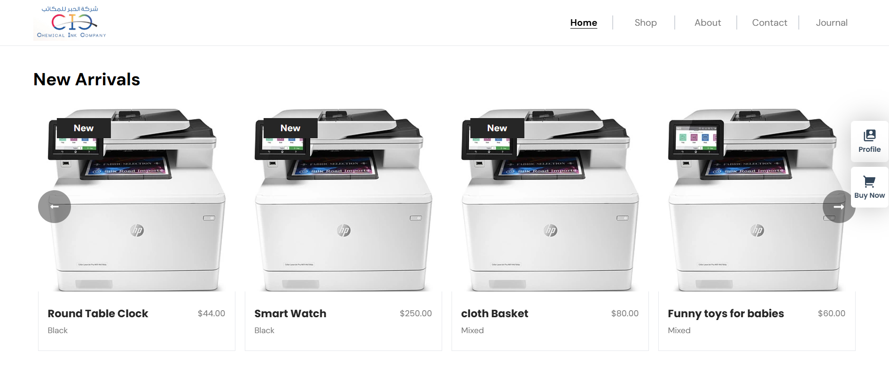
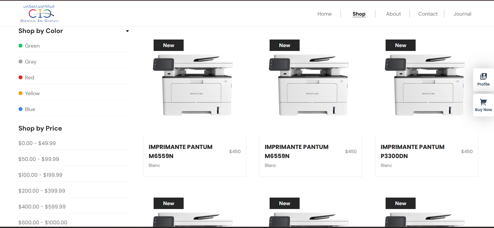
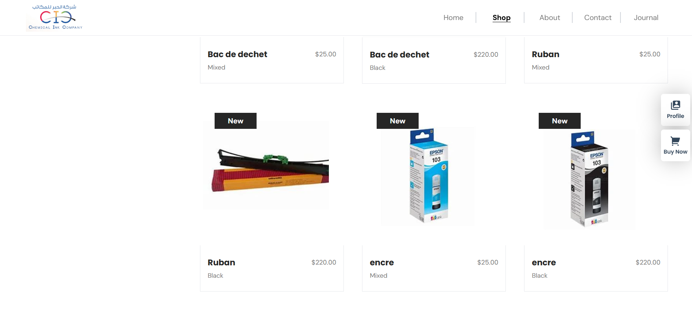

# 🖨️ Printer Store - E-commerce React App

A modern **E-commerce web application for selling printers and accessories**, built using **React.js, Redux Toolkit, and React Router v6**.  
Developed as a **freelance project** with a focus on scalability, clean architecture, and professional UI/UX.

---


## ✨ Features

- 🖨️ Browse printers by categories
- 🔍 View detailed product information
- 🛒 Add / remove items from cart
- 💳 Checkout & payment page
- 🔐 Authentication (Sign In / Sign Up)
- 🔔 Toast notifications (React Toastify)
- 📱 Fully responsive design
- ⚡ Fast and optimized performance

---
## Preview




## 🛠️ Tech Stack

- ⚛️ React.js (Hooks + Functional Components)
- 🧠 Redux Toolkit (State Management)
- 🧭 React Router DOM (v6.4+)
- 🎨 CSS / Tailwind / Bootstrap
- 🔔 React Toastify

---

---

## 🧭 Routing

| Route | Description |
|------|------------|
| `/` | Home |
| `/shop` | All printers |
| `/category/:category` | Filter by category |
| `/product/:_id` | Product details |
| `/cart` | Shopping cart |
| `/paymentgateway` | Checkout |
| `/about` | About |
| `/contact` | Contact |
| `/journal` | Blog |
| `/signup` | Register |
| `/signin` | Login |

---

## 🧠 State Management

- Redux Toolkit for global state
- Handles cart, products, and UI state
- Scalable and API-ready

---

## ⚙️ Installation

```bash
git clone https://github.com/your-username/printer-store.git
cd printer-store
npm install
npm run dev
# or
npm start
